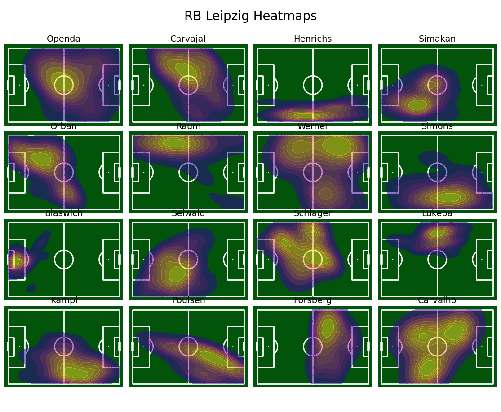

This repository attempts to create a heatmap describing the frequency of people in an enclosed boundary. For demonstrative purposes, data of the coordinates of football players in a match are visualised in heatmaps. 

# Introduction

Please install the dependencies in the `requirements.txt` file to run the demo.

The Jupyter notebook file `heatmap.ipynb` and Python file `heatmap.py` contain code for generating activity heatmaps that illustrate the spatial distribution of player movements across a football pitch. These heatmaps visually highlight the areas where players were most active during a match.

*Figure 1: Heatmap illustrating player activity across the pitch.*

*Figure 2: Another example heatmap illustrating player activity across the pitch.*

This demonstration offers a useful analogy for applications involving radar sensors in enclosed areas, where mapping the density and movement patterns of detected individuals in a heatmap format can be valuable.